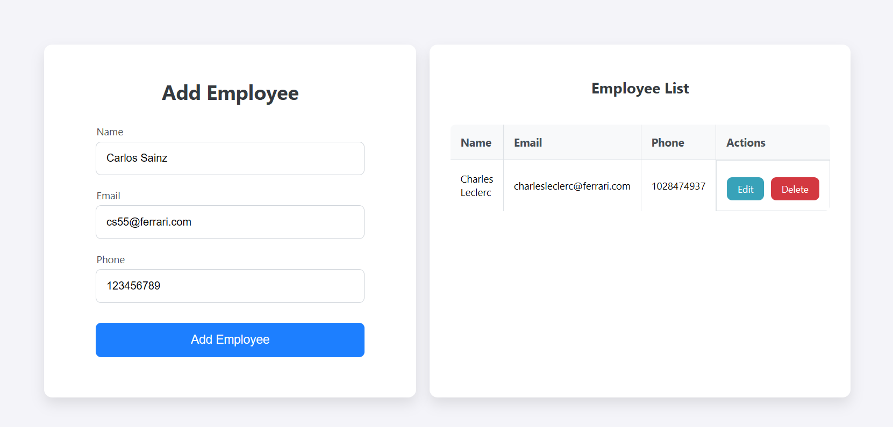

# Employee Management Application

A Django-based web application for managing employees. The application supports adding, editing, and deleting employees, and displays a list of all employees.

## Setup

### Prerequisites

- Docker
- Postgres

### Installation and Usage

1. **Clone the repository:**

    ```bash
    git clone <repository_url>
    cd django_postgres_employee_app
    ```

2. Add your database credentials to the `docker-compose.yml` file:

    ```yaml
    services:
      db:
        image: postgres:13
        environment:
          POSTGRES_DB: <database_name>
          POSTGRES_USER: <database_user>
          POSTGRES_PASSWORD: <database_password>
    ```

3. Add your database credentials to the `settings.py` file:

    ```python
    DATABASES = {
        'default': {
            'ENGINE': 'django.db.backends.postgresql',
            'NAME': '<database_name>',
            'USER': '<database_user>',
            'PASSWORD': '<database_password>',
            'HOST': 'db',
            'PORT': 5432,
        }
    }
    ```

4. **Build and run the Docker container:**

    ```bash
    docker-compose up --build
    ```

5. **Run database migrations:**

    ```bash
    docker-compose run web python manage.py migrate
    ```

6. **Access the application:**

    Open your browser and navigate to `http://localhost:8000/`.

## Usage



1. **Add Employee:**

    - Fill out the form with the employee's name, email, and phone number.
    - Click "Add Employee".

2. **Edit Employee:**

    - Click the "Edit" button next to the employee you want to edit.
    - Update the employee's information in the form.
    - Click "Update".

3. **Delete Employee:**

    - Click the "Delete" button next to the employee you want to delete.


